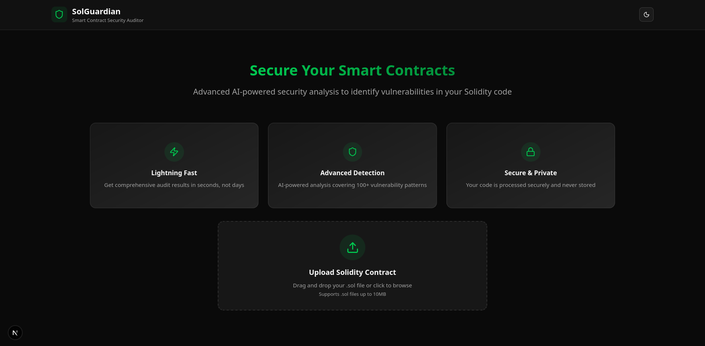
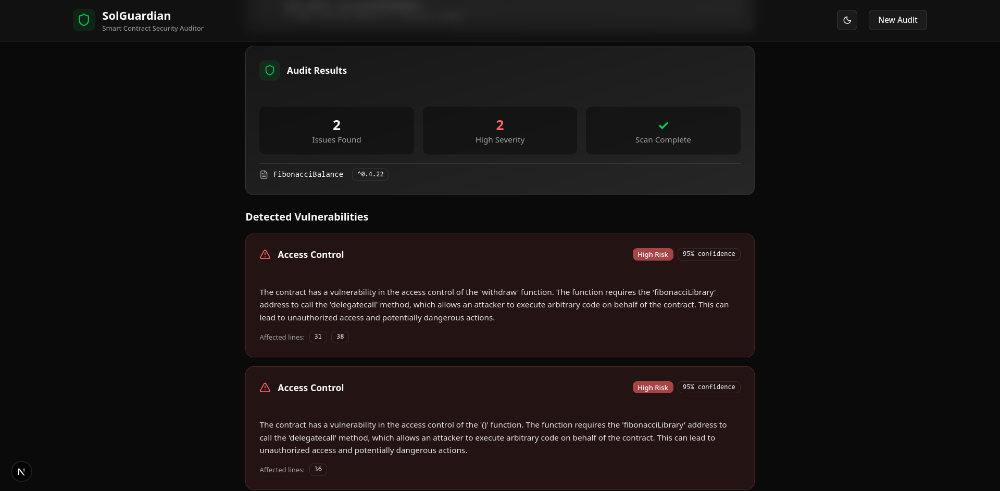

# 🛡️ SolGuardian

**SolGuardian** is an **AI-powered Solidity code auditor** that helps developers automatically detect vulnerabilities and optimize smart contracts before deployment.  
It combines **static analysis** with **LLM-based reasoning (CodeLlama + LangChain)** to provide contextual insights, explanations, and secure coding recommendations.



## 🚀 Features

- **AI-Powered Static Analysis**  
  Combines pattern-based detection with CodeLlama’s reasoning to analyze Solidity code.

- **Vulnerability Detection**  
  Finds common and advanced smart contract vulnerabilities.

- **Context-Aware Suggestions**  
  Each issue comes with an explanation and a recommended fix.

- **Readable Audit Reports**  
  Outputs structured JSON reports for easy review.

- **Fast & Developer Friendly**  
  Designed for local use no blockchain node or API dependencies.

## 🧠 Detects Vulnerabilities Like

- Reentrancy attacks
- Delegatecall misuse
- Integer overflow/underflow
- Access control flaws
- Unchecked return values

## 📷 Screenshots




## ⚙️ Tech Stack

### 🖥️ Frontend (Client)

Built with **Next.js (App Router)** and designed for a smooth, modern developer experience.

- **Framework:** Next.js 15 (Turbopack)
- **Language:** TypeScript 5
- **UI:** Shadcn UI + TailwindCSS 4 + Radix UI Primitives
- **Icons:** Lucide React
- **Theming:** next-themes (dark/light mode)
- **State Management:** Zustand
- **Form Validation:** Zod
- **HTTP Client:** Axios
- **Realtime Communication:** socket.io-client
- **File Uploads:** react-dropzone
- **Utilities:** clsx, class-variance-authority, tailwind-merge
- **Notifications:** Sonner
- **Animations:** tw-animate-css
- **Linting:** ESLint 9 + eslint-config-next

### ⚙️ Backend (Server)

TypeScript-based **Express server** integrated with **LangChain** and **CodeLlama** for AI-powered Solidity code analysis.

- **Framework:** Express 5 (TypeScript)
- **AI Analysis:** CodeLlama + LangChain (Community, Core, Ollama modules)
- **Queue System:** BullMQ
- **Cache / Message Broker:** Redis (via Docker Compose + ioredis)
- **File Handling:** Multer
- **Environment Management:** dotenv + gen-env-types
- **Validation:** Zod
- **Socket Communication:** socket.io
- **Code Style:** Prettier
- **Development:** ts-node-dev, nodemon
- **Build Tool:** TypeScript Compiler (tsc)

## 🚀 Installation

Clone the repository

```bash
git clone https://github.com/naman22a/SolGuardian
cd SolGuardian
```

Run Docker Compose

```bash
docker compose up
```

visit http://localhost:3000 to view the web application

## 🧭 Future Scope

- Multi-file project scanning
- In-context learning via CodeLlama fine-tuning
- CI/CD pipeline integration
- VSCode extension

## 🤝 Contributions

Contributions, issues, and suggestions are welcome! Feel free to fork the repository and submit pull requests.

## 📫 Stay in touch

- Author - [Naman Arora](https://namanarora.xyz)
- Twitter - [@naman_22a](https://twitter.com/naman_22a)

## 🗒️ License

SolGuardian is [GPL V3](./LICENSE)
